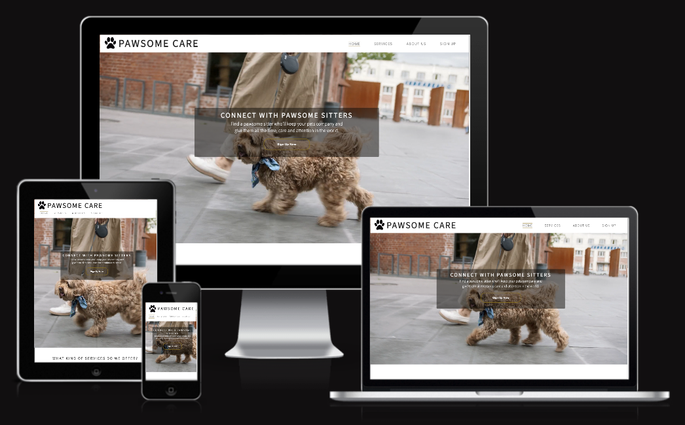
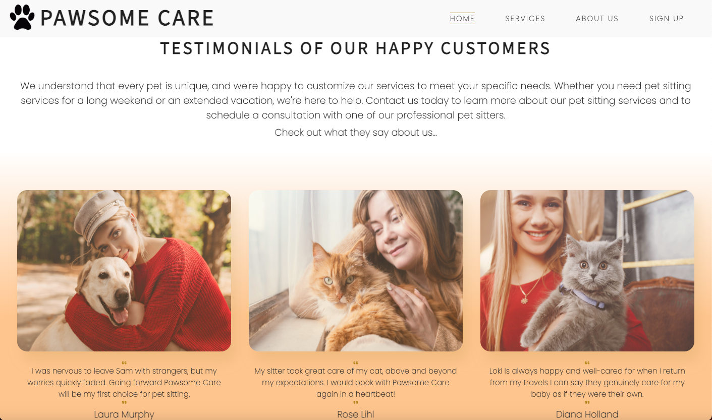
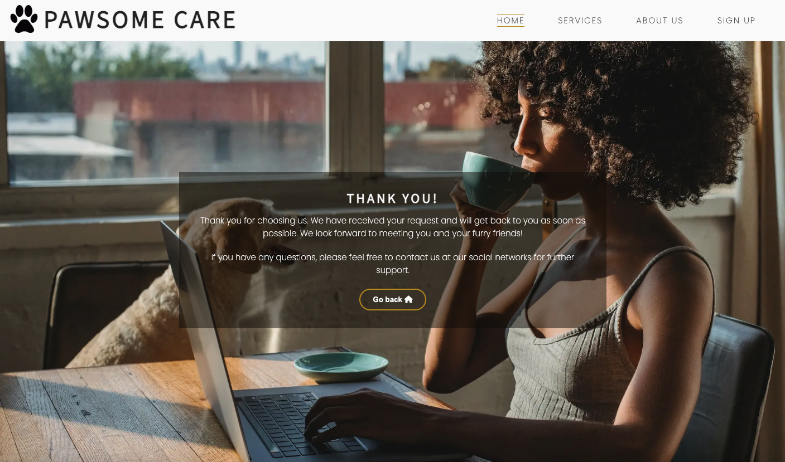
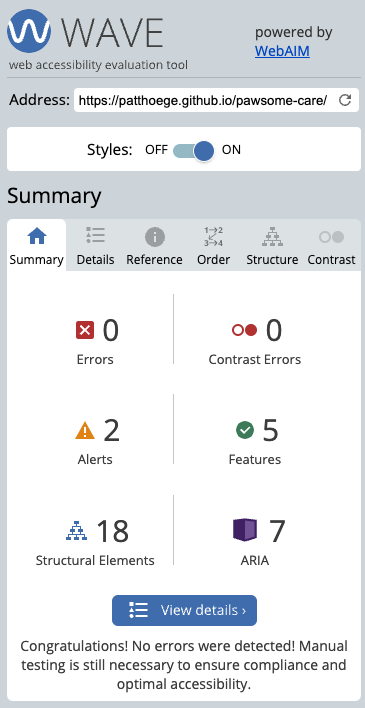

# Pawsome Care is awesome care

**Pawsome Care** is an online platform that serves as an intermediary between pet owners and local pet sitters. We offer a user-friendly interface for pet owners to sign up and submit their details. Based on the provided information, we connect the pet owner with our most suitable and reliable pet sitter. At PawsomeCare, we understand the importance of providing quality services that make pets feel comfortable and secure. Therefore, we ensure that our pet sitters are experienced and well-qualified individuals who are passionate about caring for animals. By providing a safe and nurturing environment for pets, PawsomeCare aims to enhance the overall well-being of pets and their owners alike.

You can view the live site here - <a href="https://patthoege.github.io/pawsome-care/" target="_blank" rel="noopener">Pawsome Care</a>

## Table of Contents

* [**UX**](<#user-experience-ux>)
    * [Site Purpose](#site-purpose)
    * [Site Goal](#site-goal)
    * [Audience](#audience)
    * [Communication](#communication)
    * [Current User Goals](#current-user-goals)
    * [New User Goals](#new-user-goals)
* [**Design**](<#design>)
  + [Wireframes](#wireframes)
  + [Color Scheme](#color-scheme)
  + [Typography](#typography)
  + [Imagery](#imagery)
* [**Features**](<#features>)
    
    * [Navigation Menu](<#navigation-menu>)
    * [Home](<#home>)
    * [Services](<#services>)
    * [Testimonials](<#testimonials>)
    * [Sign Up Page](<#contact>)
    * [Thank You Page](<#contact>)
    * [Footer](<#footer>)
* [**Technologies Used**](<#technologies-used>)
* [**Testing**](<#testing>)
   *  [Validator testing](<#validator-testing>)
   * [Manual testing](<#manual-testing>)
   * [Lighthouse testing](<#lighthouse-testing>)
   * [Experte testing](<#experte-testing>)
   * [Wave testing](<#wave-testing>)
   * [Bugs](<#bugs>)
* [**Deployment**](<#deployment>)
* [**Credits**](<#credits>)
    * [**Content**](<#content>)
    * [**Media**](<#media>)
*  [**Acknowledgments**](<#acknowledgements>)

## UX

### Site Purpose
The purpose of the Pawsome Care website is to provide a platform for pet owners to connect with local pet sitters to find a reliable and trustworthy person to take care of their pets while they are away.  
[Back to top](<#table-of-contents>)

### Site Goal
The goal of the website is to simplify the process of finding a pet sitter and ensure that pet owners have peace of mind knowing that their pets are in good hands.  
[Back to top](<#table-of-contents>)

### Audience
The Pawsome Care website targets pet owners who are looking for trustworthy and reliable pet sitters to take care of their pets while they are away.  This audience includes individuals who may be going on vacation, busy professionals, frequent travelers, or anyone who needs assistance with pet care.  
[Back to top](<#table-of-contents>)

### Communication
 The website has a clear and bold design that makes it easy for visitors to access information. They are marked so users can easily navigate and find what they need without having to search extensively.
1. The website's sign-up form allows pet owners to submit their information and request pet care services before reading about the different types of services offered. This initial form of communication allows the pet-sitting service to understand the customer's needs and preferences before providing them with appropriate service options.
2. Throughout the process of arranging for pet care services, the pet owners and the pet sitting service can communicate with each other via email or phone to discuss details such as scheduling, pricing, and pet care instructions. This ensures effective communication and a smooth process for both parties.

It should be noted that the website provides information about the different types of services they offer, but the sign-up form is the main means of communication between the pet owner and the pet-sitting service.  
[Back to top](<#table-of-contents>)

### Current User Goals
1. The primary goal for current users of Pawsome Care is to provide them with high-quality and reliable pet-sitting services that meet their needs and expectations.
2. Other goals may include providing personalized and tailored services, ensuring the safety and well-being of pets, and building a trustworthy relationship between pet owners and pet sitters.
3. Ultimately, the goal is to create a positive experience for both pet owners and pet sitters and foster a sense of community within the platform.

[Back to top](<#table-of-contents>)

### New User Goals
1. The website is designed to be user-friendly and easy to navigate, providing a hassle-free experience for busy pet owners.
2. Pawsome Care's platform aims to provide a streamlined and easy-to-use service to connect them with experienced and trusted pet sitters in their local area.
3. By connecting pet owners with trusted and experienced pet sitters, Pawsome Care aims to provide peace of mind for users who may be worried about leaving their pets in someone else's care. 

[Back to top](<#table-of-contents>)

## Design

### Wireframes

The wireframes for the project can be found [here.](/assets/readme-img/PawsomeCare%3AWireframe%3AProject1..pdf)

### Color Scheme
The color palette was created with the thought to provide as much simplicity as possible, without feeling overwhelming. Most of the color is primarily provided by the supporting images displayed across the site. However, text, headers, icons & backgrounds were generated in white, a subtle touch of satin sheen gold and peach. The combination of the two does not overwhelm the user.

[Back to top](<#table-of-contents>)

### Typography
Poppins font style was selected for the main heading on each of the pages, accompanied by Source Sans 3. Sans Serif, if the mentioned fonts can't be loaded.   
[Back to top](<#table-of-contents>)

### Imagery
The website features imagery, including the Hero video, that was sourced from free vector photo platforms. These images have been credited in the Credits section of the website. The purpose of using these images was to find the perfect introductory image that conveys to the user the purpose of the site. The images were sourced through a Google search to ensure their relevance and effectiveness in communicating the site's purpose.  
[Back to top](<#table-of-contents>)

## Features

### Navigation Menu
 Pawsome Care is a three-page website that has 4 navigation links for the user to use. The [Home](index.html) is the default loading page and the subsequent sections of the home page are **Services**, **About Us** and lastly, the **Sign Up** page which leads to a form to submit. The pages are all accessible primarily from the navigation menu however the user simply has to scroll down the website, and they will visit these sections in the order above. The CSS stylesheet for a website with a fixed header. The logo is floated to the left and the menu items are to the right.  

<b>Desktop Navigation Bar Image</b>

 

[Back to top](<#table-of-contents>)

### Home
The main section of the website features a captivating video that zooms in on the subject to further clarify to the user that this website is about pet-sitting and in the center there is a catchy and appealing text content box with a simple yet effective button that encourages the user to learn more. Clicking this button the user will be directed to the Sign Up page.

<b>Desktop Home Image</b>

 

[Back to top](<#table-of-contents>)

 

### Services
The section immediately following the hero section on the website is the club ethos section, which provides a detailed overview of the services offered. It is divided into two columns, with an image on the left and a list of services and their descriptions on the right. The font size and color scheme are consistent throughout the website, with white text on a dark, transparent background. The color scheme is primarily black, white, and shades of yellow. 

<b>Desktop Services Image</b>

 

[Back to top](<#table-of-contents>)

### Testimonials

The testimonials section features a gradient background color and is comprised of a brief paragraph about the website. Below the paragraph, there are three images placed next to each other with some space in between. When the user hovers over each image, there are hover effects such as the menu items. The purpose of this section is to showcase positive reviews from satisfied customers. 

<b>Desktop Testimonials Image</b>

 

[Back to top](<#table-of-contents>)

### Sign Up Form
The sign-up page is easily accessible to users through various means. Users can access the sign-up form by clicking the "Sign Up Now" button on the hero video landing page, as well as through the navigation bar items. The form can also be found in the footer section of the website. The user is directed to the sign-up page, where they can easily provide their details such as username, email, phone number, location, type of pet, and any specific instructions through a simple form.

<b>Desktop Sign Up Page Image</b>

 

[Back to top](<#table-of-contents>)

### Thank You Page
After completing the sign-up process, users will be directed to the thank you page, where they will see a content text box thanking them for choosing Pawsome Care. In addition to the content, the thank you page also includes a button that allows users to return to the home page. This page serves as confirmation that their registration was successful and that they will soon be able to enjoy the benefits of our platform. The thank you page is a small but important detail that shows our commitment to customer satisfaction and appreciation for their trust in our services.

<b>Desktop Thank You Image</b>

 

[Back to top](<#table-of-contents>)

### Footer 
At the bottom of the website, you can find the footer section which includes four social network icons for Whatsapp, Facebook, Github, and Linkedin. Below the social network icons, you can find links to the home, services, and sign-up form pages. Finally, at the bottom of the footer, you can find the copyright information.

<b>Desktop Footer Image</b>

 

[Back to top](<#table-of-contents>)

# Technologies Used
* [HTML5](https://en.wikipedia.org/wiki/HTML) - Provides the content and structure for the website.
* [CSS3](https://en.wikipedia.org/wiki/CSS) - Provides the styling for the website.
* [Gitpod](https://www.gitpod.io/) - Used to create and edit the website.
* [Visual Studio Code - VSCode](https://code.visualstudio.com/) - Local editor to edit the website.
* [GitHub](https://github.com/patthoege/pawsome-care) - Used to host and deploy the website. 
* [Balsamiq](https://balsamiq.com/ ) - Used to create the wireframes.

[Back to top](<#table-of-contents>)

## Testing
* ## Code Validation

    * The Pawsome Care website has been thoroughly tested. All the code has been validated via the [W3C HTML Validator](https://validator.w3.org/) and the [W3C CSS Validator](https://jigsaw.w3.org/css-validator/). Minor errors were found when tested on [HTML Validation](https://validator.w3.org/) but were fixed immediately and documented below. 

### Validator Testing

<b>W3C HTML Validator Image</b>

 

<b>W3C CSS Validator Image</b>

 

[Back to top](<#table-of-contents>)

### Lighthouse Testing

<b>Lighthouse Test Image</b>

<a href="https://www.webpagetest.org/" target="_blank" rel="noopener">Lighthouse Page</a>

 

[Back to top](<#table-of-contents>)

### Experte Testing

<b>Experte Accessibility Report</b>

<a href="https://www.experte.com/accessibility" target="_blank" rel="noopener">Experte Accessibility Page</a>

 

[Back to top](<#table-of-contents>)

### Wave Testing

<b>Wave Evaluation Tools Report</b>

<a href="https://wave.webaim.org/" target="_blank" rel="noopener">Webaiam Page</a>

 

[Back to top](<#table-of-contents>)

* ## Browser Compatibility
    * The website has had manual and responsive tests conducted on the below browsers.
        * Google Chrome
        * Mozilla Firefox
        * Safari
          

# Bugs

## Fixed bugs
- The images in the testimonial section were not visible on the deployed website due to an issue with the CSS style sheet. The Slack Community help me discover that the image paths needed to be relative to properly display it.
- During the validation of the signup.html page, errors were triggered on the HTML validator.FORM element can't be nested. Before, I was attempting to set an action attribute for the thank you page to the button form within the sign-up form. However, I realized that I could place the action attribute to the first register form to resolve the issue.
- After the process of making my website responsive to small screens, I encountered an issue where horizontal scrolling caused a noticeable white space. This problem was traced to the margin of the image in the ethos section, which was responsible for the layout discrepancy. With the assistance and help of my educator, the issue was resolved by deleting it.

## Deployment

This project was deployed via GitHub Pages and the Gitpod browser, used as a development environment. From here I could commit and push my changes throughout the project.

Steps I took to deploy my website;

- Go to the repository for pawsome-care 
- Click the Settings tab and locate the Pages tab
- Select to deploy from main branch
- A few minutes later, upon refreshing the page, my site was live.  

[Back to top](<#table-of-contents>)

# Credits
### Content

* The font came from [Google Fonts](https://fonts.google.com/)
* The color palette was displayed by [Coolors](https://coolors.co/)
* The icons came from [Font Awesome](https://fontawesome.com/)
* Converter image to webp format for better performance from [Convertio](https://convertio.co/) 
* The responsive preview image at the top of the README.md came from [AmIResponsive?](https://ui.dev/amiresponsive?)
* The text content came with some help from [ChatGPT](https://openai.com/blog/chatgpt) 

### Media
* The images came from [Pexels](https://www.pexels.com/) and [Freepik](https://www.freepik.com/).

[Back to top](<#table-of-contents>)

# Acknowledgments
This website was created as part of my Full Stack Software Developer Diploma at the [Code Institute](https://codeinstitute.net/) and serves as my Portfolio Project 1. I am grateful to acknowledge my mentor [Martina Terlević](https://www.linkedin.com/in/martinaterlevic/), the Slack community, and the entire team at the Code Institute for their assistance and support throughout this process. Pawsome Care has been an invaluable learning experience for me, enabling me to gain greater confidence in my abilities to design, build, test and deploy a fully functional website.

Patricia Höge 2023.

[Back to top](<#table-of-contents>)

#

